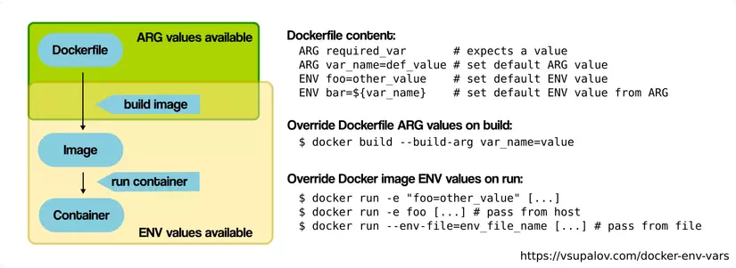
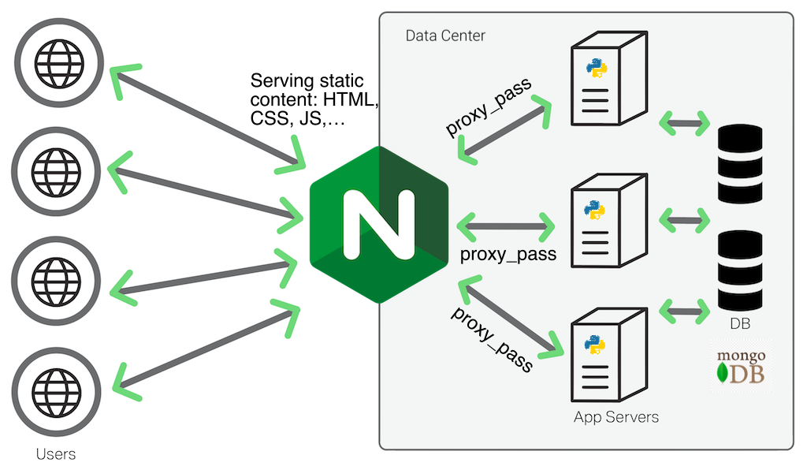
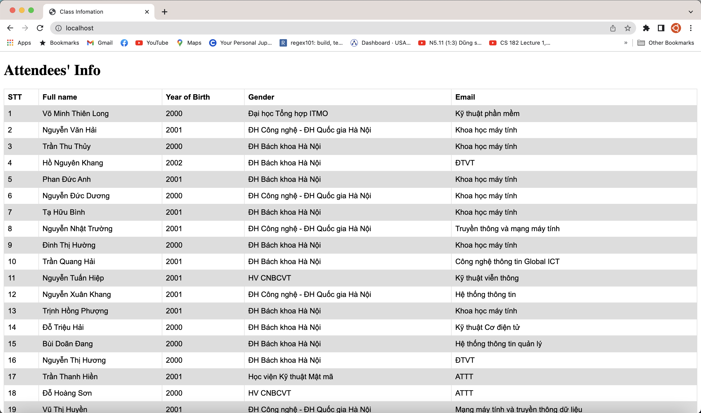

# 1. PHÂN BIỆT CÁC INSTRUCTION

## 1.1. ARG vs ENV

Cả ARG và ENV đều là các instruction dùng để define các biến trong Docker tuy nhiên, phạm vi các biến khai bảo bởi 2 instruction này là khác nhau.

> ENV dùng để khai bao các biển dùng khi chạy container trong tương lai còn ARG dùng cho quá trình building image.

Cụ thể:

- ENV được sử dụng khi để define các biến môi trường mà các app chạy container sẽ truy cập được các biến này. Thường thì các biến này sẽ được dùng để configure các app chạy trong container.
- ARG được sử dụng để define các biến mà sau khi build xong image sẽ không sử dụng được các biến này nữa.

Tuy nhiên, ENV cũng có thể được sử dụng trong quá trình build image. Ta có thể override biến ARG khi build image bằng --build-arg và override biến ENV bằng -e khi run container.

Để khai báo một biến ENV hoặc ARG ta sử dụng:

        ENV variable_name=value
        ARG variable_name=value

Để sử dụng một biến ENV hoặc ARG ta sử dụng:

        ${var_name}

Ta có thể chỉ định giá trị mới (thay vì giá trị khai báo trong Dockerfile) của biến ARG khi build image bằng cách override bằng --build-arg nhưng không thể làm như vậy với biến ENV, nhưng ta có thể thay đổi bằng cách set biến ENV bằng 1 biến ARG như sau:

        ARG var_1 = value
        ENV var_2 = ${var_1}

## 1.2. COPY vs ADD

COPY và ADD đều có tính năng tương tự nhau đó là copy file từ local vào trong container. Điểm khác chính là ADD hỗ trợ thêm 2 tính năng là local-only tar extraction và fetch packages from remote URLs.

Về cơ bản thì COPY được khuyên dùng hơn do nó dễ hiểu và rõ ràng hơn. ADD được sử dụng trong các trường hợp ta cần extract file tar trong container.

Nếu ta có Dockerfile sử dụng nhiều file thì lệnh COPY nên được dùng riêng ra thay vi copy hết tất cả các file. Điều này sẽ tận dụng được việc caching khi mà các file riêng lẻ không có sự thay đổi.

Ta không nên sử dụng lệnh ADD để fetch các packages từ remote URL, thay vào đó ta nên sử dụng curl hoặc wget để xoá được các packeage không cần thiết sau khi đã extract và không bị mất thêm một layer cho lệnh ADD, ví dụ, thay vì sử dụng:

    ADD https://example.com/big.tar.xz /usr/src/things/
    RUN tar -xJf /usr/src/things/big.tar.xz -C /usr/src/things
    RUN make -C /usr/src/things all

Ta có thể dùng curl:

    RUN mkdir -p /usr/src/things \
        && curl -SL https://example.com/big.tar.xz \
        | tar -xJC /usr/src/things \
        && make -C /usr/src/things all

## 1.3. CMD vs ENTRYPOINT

CMD và ENTRYPOINT đều dùng để định ra program mà ta muốn execute khi mà ta chạy docker run.

Điểm khác nhau giữa CMD và ENTRYPOINT đó là ENTRYPOINT sẽ configure khi run container như một lệnh (executable), nói cách khác mọi biến được define sau tên của image sẽ được append vào lệnh trong ENTRYPOINT như một biến còn đối với CMD thì khi ta thêm vào đằng sau tên image của lệnh docker run image thì nó sẽ override lệnh CMD này (do CMD chỉ là lệnh default sẽ được chạy khi docker run), ví dụ:

        FROM ubuntu
        CMD  ["echo", "Hello World"]

Khi ta build và chạy image này output sẽ là Hello world. Khi ta thêm arg vào docker run như sau:

        docker run test echo "Vietnam"

Output sẽ là Vietnam thay vì Hello World (do lệnh CMD sẽ bị override):

Đối với ENTRYPOINT thì các arguments được thêm vào sau docker run sẽ chỉ được append vào sau lệnh ENTRYPOINT. Ví dụ:

        FROM ubuntu
        ENTRYPOINT ["echo", "Hello World"]

Vậy khi ra chạy docker run test "Hi" thì "Hi" sẽ được append vào lệnh echo "Hello World" thay vì override:

Nếu ta thêm echo "Hi" vào thì sẽ như thế nào, rõ ràng lệnh này sẽ bị output Hello world echo Hi do khi append thì nó sẽ thành echo "Hello World" echo "Hi", khi này ["Hello World", "echo", "Hi"] sẽ là argument của lệnh echo:

Một điểm đặc biệt nữa là khi mà CMD không khai báo ở dạng [arg1, agr2] mà không phải CMD cmd agr1... hoặc CMD ["executable","arg1",...] thì nó sẽ được coi như là default argument cho ENTRYPOINT. Như vậy trong trường hợp này, khi mà ta không thêm argument vào sau docker run image thì CMD argument sẽ được sử dụng. Ngược lại thì argument trong CMD sẽ bị override khi có argument mà ta append sau lệnh docker run image.

# 2. THREE-TIER WEB APPLICATION WITH DOCKER

## 2.1. Tổng quan về kiến trúc three-tier

Three-tier architecture tổ chức web app thành 3 lớp logical và physical: presentation tier hay còn gọi là user interface; application layer nơi mà các data được xử lí và cuối cùng là data tier dùng để store và manage data, đây là một mô hình phổ biến của client-server application:

- Presentation tier: đây là tier cung cấp giao diện cho người dùng để giao tiếp với ứng dụng. Nó được chạy trên một web browser. Thường được viết bằng HTML, CSS và JS. Để serving được các file HTML, CSS và JS ta sẽ sử dụng NGINX. Đồng thời NGINX cũng sẽ đóng vai trò là một proxy server để pass các request đến application tier, củ thể ở project này là request data thông tin attendee của lớp học.
- Application tier: ở tier này sẽ tiến hành lấy và xử lí thông tin từ data tier, đồng thời cũng có thực hiện các thao tác CRUD trên datat tier. Ở project này ta sẽ sử dụng Python với Flask framework để develop.
- Data tier: hay còn gọi là database tier, tier này có nhiệm vụ chính là lưu trữ và quản lí dữ liệu. Ta sẽ sử dụng một NoSQL DB là MongoDB trong project này.

## 2.2. Tạo Dockerfile cho mongoDB

Đối với mongoDB ta có thể sử dụng ngay image mongo để chạy container, tuy nhiên ở đây ta sẽ custom lại DB một chút để nó init sẵn collection attendee chứa thông tin của các thành viên trong lớp.

Trước hết ta vẫn sử dụng base image là mongo:5.0

        FROM mongo:5.0

Ta sẽ đặt các biến enviroment để mongod sẽ khởi tạo sẵn database và user admin như biến ta đặt:

        ENV MONGO_INITDB_ROOT_USERNAME="admin"
        ENV MONGO_INITDB_ROOT_PASSWORD="Phananh272"
        ENV MONGO_INITDB_DATABASE="class"

Khi chạy container thì image mongo:5.0 sẽ có entrypoint là chạy file shell script docker-entrypoint.sh, ở trong file này trước hết nó sẽ tạo sẵn DB và user theo biến ENV mà ta đặt, sau đó nó sẽ chạy file sh hoặc js trong folder /docker-entrypoint-initdb.d/. Trước hết ta sẽ tạo file [db-init.js](mongo/db-init.js) để init collection attendee trong data base class rồi COPY file này vào thư mục /docker-entrypoint-initdb.d/.

        COPY ./db-init.js /docker-entrypoint-initdb.d/

Tuy vậy để load được một file csv có các documents mặc định vào collection attendee thì không được hỗ trợ trong db-init.js. Thay vào đó ta phải sử dụng một tool của mongoDB là mongoimport có sẵn trong image mongo:5.0. Có rất nhiều cách để sử dụng công cụ này, ta có thể run container xong rồi dùng _docker exec \<container> mongoimport_
(cách này thì khá thủ công). Một cách nữa là ta sẽ chạy 2 container mongo, mongo thứ 2 sẽ chỉ để sử dụng để chạy mongoimport như trong [tutorial của Shan's Corner](https://shantanoo-desai.github.io/posts/technology/seeding-mongodb-docker-compose/). Cách thứ 3 là ta có thể chỉnh sử một chút file docker-entrypoint.sh để có thể load được documents trong file csv. Ta sẽ custom file [docker-entrypoint.sh](https://github.com/docker-library/mongo/blob/master/5.0/docker-entrypoint.sh) (đây cũng là file official được public trên github). Chắc chắc sẽ có một số cách hay hơn để seeding được database nhưng trong thời gian giới hạn em vẫn chưa tìm hiểu thêm được.

Trong file này, dòng cuối cùng sử dụng lệnh exec để chạy mongod (Mongo Deamon), như vậy để sử dụng được file này ta chắc chắn phải chạy mongod trước để nó tạo ra được database, collection và user rồi mới sử dụng được mongoimport để kết nối tới mongo để import file csv. Một cách đơn giản là ta có thể thêm lệnh mongoimport vào ngay dòng exec "$@" [docker-entrypoint.sh](https://github.com/docker-library/mongo/blob/master/5.0/docker-entrypoint.sh) như sau:

        exec "$@" &
        mongoimport --db class --collection attendee --type=csv --username admin --password Phananh272 --authenticationDatabase admin --headerline --file=/data/datasource.csv --uri mongodb://localhost:27017

Như vậy khi run container thì sẽ bị exit ngay lập tức do ta chạy file này thì exec \"&#36;\@\" &#38; sẽ chạy trong một process có pid không phải là 1, pid 1 giờ đây sẽ là của shell, sau khi chạy đến lệnh mongoimport xong thì pid 1 này cũng hoàn thành xong công việc và terminate. Khi pid terminate thì container cũng sẽ tự động exit do không có một init process đang chạy (Nếu không có operator &#38; ở cuối thì đương nhiên sẽ không chạy lệnh mongoimport do lệnh trên không bao giờ exit). Như vậy mục tiêu của ta là phải để exec \"&#36;\@\" chạy trên pid 1 và mongimport phải thực hiện sau exec \"&#36;\@\". Ta chỉ cần chạy (sleep && mongoimport) &#38; trước exec \"&#36;\@\" (ta sleep nhằm mục đích cho mongd hoàn tất khởi tạo), thì sleep && mongoimport sẽ được chạy trên một pid khác và sau đó khi chạy exec "\$@" nó sẽ thay thế shell và chạy trên pid 1 \(nhược điểm của phương pháp này là sẽ tạo ra zoombie process hay defunct process do khi mongimport chạy xong thì parent process của nó là chính là pid 1 đang chạy mongod thay thế shell do lệnh exec, chính vì thế mà pid 1 này sẽ không wait process con này, dẫn tới nó không thể nhận accept để exit -> trở thành zombie):

        (sleep 5 && mongoimport --db class --collection attendee --type=csv --username admin --password Phananh272 --authenticationDatabase admin --headerline --file=/data/datasource.csv --uri mongodb://localhost:27017) &

        exec "$@"

Sau khi chỉnh xong, ta copy file csv và file docker-entrypoint.sh vào:

        COPY ./datasource.csv /data/datasource.csv
        COPY docker-entrypoint.sh /usr/local/bin/

## 2.2. Tạo Dockerfile cho Python Web Server

Python Web Server sẽ sử dụng 2 thư viện là Flask (viết API) và pymongo (kết nối với database). App này khá đơn giản, chỉ có 1 API GET /api/attendees để lấy thông tin tất cả các attdedee về:

        from flask import Flask
        from flask import jsonify
        import pymongo
        from bson.json_util import dumps

        client = pymongo.MongoClient('mongodb://web_mongo:27017/', username='admin', password='Phananh272')

        db = client["class"]

        col = db['attendee']

        app = Flask(__name__)

        @app.route('/api/attendees', methods = ['GET'])
        def get_attendee():
        res = []
        for x in col.find():
                res.append(x)
        return jsonify(dumps(res))

Ta có thể viết thêm một số Restful API để cho app được hoàn thiện hơn, nhưng nó nằm ngoài mục đích của project này là nhằm hiển thị thông tin danh sách lớp. Ta sẽ giữ app này đơn giản nhất có thể.

Trước hết, ta sẽ frezze pip3 để lấy thông tin library đẩy vào file requirements.txt:

        pip3 freeze | grep Flask >> requirements.txt
        pip3 freeze | grep

Ta sử dụng base image là python:3.9 và tạo working directory app để làm việc:

        FROM python:3.9

        WORKDIR /app

Tiếp theo là copy requirements.txt và tiến hành cài đặt các dependencies, ta cũng sẽ áp dụng việc đẩy requirements.txt và cài nó trước với --no-cache-dir để giảm thời gian build và rebuild:

        COPY ./requirements.txt .

        RUN pip3 install --no-cache-dir -r ./requirements.txt

Copy source code vào /app và instruct Docker chạy python app tại tất cả IP của container sau khi run container bằng CMD:

        COPY ./app.py .

        CMD [ "python3", "-m" , "flask", "run", "--host=0.0.0.0"]

## 2.3. Tạo Dockerfile cho NGINX

NGINX trong project sẽ đóng 2 vai trò, 1 serving các static file như HTML, CSS, JS cho client và làm một proxy server để forward các API request đến Web Server. Như vậy, ta sẽ sử dụng file nginx.conf để configure NGINX:

        server {
                listen 80;

                location / {
                        root /usr/share/nginx/html;
                }

                location /js/ {
                        root /usr/share/nginx/html/;
                }

                location /api/ {
                        proxy_pass http://web_python:5000;
                }
        }

Client sẽ request để lấy file HTML và JS ở NGINX, nếu client gọi API thì NGINX sẽ forward tới Web Server, ở đây chính là container web_python mà ta đã chạy và đặt tên (Ta chỉ cần tên của container chứ không cần địa chỉ IP vì khi sử dụng docker-compose sẽ tự tạo một network mới và sẽ có một dịch vụ DNS để access container qua tên).

Ta cũng sẽ copy các file index.html và js.js vào để NGINX serve các file này:

        FROM nginx:1.22.0-alpine

        COPY ./nginx.conf /etc/nginx/conf.d/default.conf

        COPY ./index.html /usr/share/nginx/html/index.html

        RUN mkdir /usr/share/nginx/html/js/

        COPY ./js/js.js /usr/share/nginx/html/js/js.js

## 2.4. Deploy bằng Docker-compose

Project của ta sẽ gồm service, tương ứng với nginx, web_server và mongodb. Ta tổ chức file như sau:

        .
        ├── nginx/
        │   ├── Dockerfile
        │   ├── index.html
        │   ├── nginx.conf
        │   └── js/
        │       └── js.js
        ├── python/
        │   ├── Dockerfile
        │   ├── app.py
        │   └── requirements.txt
        ├── mongo/
        │   ├── Dockerfile
        │   ├── db-init.js
        │   ├── docker-entrypoint.sh
        │   └── datasource.csv
        ├── docker-compose.yml
        └── readme.md

Đối với service mongdb, ta chỉ cần sử dụng Dockerfile để build:

        web_mongo:
          build: ./mongo

Đối với service python, tương tự như web_mongo, tuy nhiên do web_server này phụ thuộc vào web_mông nên ta thêm trường depends_on:

        web_python:
          build: ./python
          depends_on:
            - "web_mongo"

Đối với service nginx, service này depend vào web_python, nên ta cũng thêm trường depend, đồng thời mount directory của html ra để dễ dàng develop do file này phải thay đổi thường xuyên. Publish cổng 80 của container ra cổng 80 của host:

        web_nginx:
          build: ./nginx
          depends_on:
            - "web_python"
          volumes:
            - ./nginx:/usr/share/nginx/html
          ports:
            - 80:80

File docker-compose.yml đầy đủ:

        version: "3.9"
        services:
          web_mongo:
            build: ./mongo
          web_python:
            build: ./python
            depends_on:
              - "web_mongo"
          web_nginx:
            build: ./nginx
            depends_on:
              - "web_python"
            volumes:v
              - ./nginx:/usr/share/nginx/html
            ports:
              - 80:80

Thực hiện build, kết qủa với 3 image:

Chạy các container bằng docker-compose up, dùng browser truy cập vào localhost cổng 80:

Như vậy, ta đã deploy thành công project.

# TÀI LIỆU THAM KHẢO

- https://docs.docker.com/
- https://shantanoo-desai.github.io/posts/technology/seeding-mongodb-docker-compose/
- https://www.mongodb.com/docs/
- http://nginx.org/en/docs/
- https://vsupalov.com/docker-arg-vs-env/
