#**SET UP WEB APP USING DOCKER COMPOSE**

#Content
#####I/ Knowledge base
 
#####1.1 Prometheus

#####1.2 Grafana

#####1.3 Node Exporter

#####1.4 ALert Manager

#####II/ Assignment

#####2.1 Deploy monitoring stack

#####2.1.1 Prerequisites

#####2.1.2 File dockercompose.yml

#####2.1.3. File prometheus.yml

#####2.2 Define alert rules 

#####2.3 Configure alertmanager to push alert to mail

#####2.4 Create Grafana dashboard

##### References

#**I/ Knowledge base**

##1.1 Prometheus

**_1.1.1. What is Prometheus?_**

- Prometheus is a open source Linux Server Monitoring tool mainly used for metrics monitoring, event monitoring, alert management, etc.

- Prometheus has changed the way of monitoring systems and that is why it has become the Top-Level project of Cloud Native Computing Foundation (CNCF).

- Prometheus uses a powerful query language i.e. “PromQL”.

- In Prometheus tabs are on and handles hundreds of services and microservices.

- Prometheus use multiple modes used for graphing and dashboarding support.

**_1.1.2. Prometheus Architecture_**

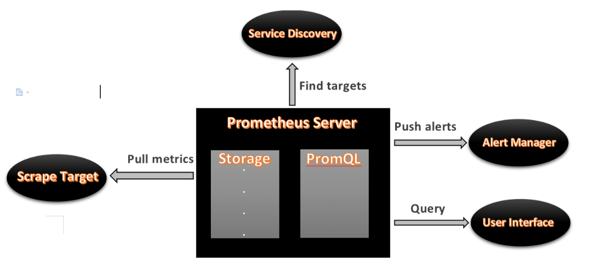

As above you can see an architecture of Prometheus monitoring tool. It was made a basic design to understand it easily.

**_1.1.3. Prometheus Components_**

**Prometheus Server**

- Prometheus server is a core of Prometheus architecture which is divided into several parts like Storage, PromQL, HTTP server, etc.

- In Prometheus server data is scraped from the target nodes and then stored int the database.

  - Storage: Storage in Prometheus server has a local on disk storge.
  - PromQL: Prometheus uses its own query language i.e. PromQL which is very powerful querying language.
PromQL allows the user to select and aggregate the data.

**Service Discovery**

- With the help of Service discovery the services are identified which are need to scraped.

- To Pull metrics, identification of services and finding the targets are compulsory needed.

- Through Service discovery we monitor the entities and can also locate its targets.

**Scrape Target**

- Once the services are identified and the targets are ready then we can pull metrics from it and can scrape the target.

- We can export the data of end point using node exporters.

- Once the metrics or other data is pulled, Prometheus stores it in a local storage.

**Alert Manager**

- Alert Manager handles the alerts which may occurs during the session.

- Alert manager handles all the alerts which are sent by Prometheus server.

- Alert manager is one of the very useful component of Prometheus tool.

- If in case any big error or any issue occurs, alert manager manage those alerts and contact with human via E-mail, Text Messages, On-call, or any other chat application service.

**User Interface**

- User interface is also a important component as it builds a bridge between the user and the system.

- In Prometheus, user interface are note that much user friendly and can be used till graph queries.

- For good exclusive dashboards Prometheus works together with Grafana (visualization tool).

- Using Grafana over Prometheus to visualize properly we can use custom dashboards.

- Grafana dashboards displays via pie charts, line charts, tables, good data graphs of CPU usage, RAM utilization, network load, etc with indicators.

## 1.2 Grafana

- Grafana is a free and open source visualization tool mostly used with Prometheus to which monitor metrics.

- Grafana provides various dashboards, charts, graphs, alerts for the particular data source.

- Grafana allows us to query, visualize, explore metrics and set alerts for the data source which can be a system, server, nodes, cluster, etc.

- We can also create our own dynamic dashboard for visualization and monitoring.

- We can save the dashboard and can even share with our team members which is one of the main advantage of Grafana.

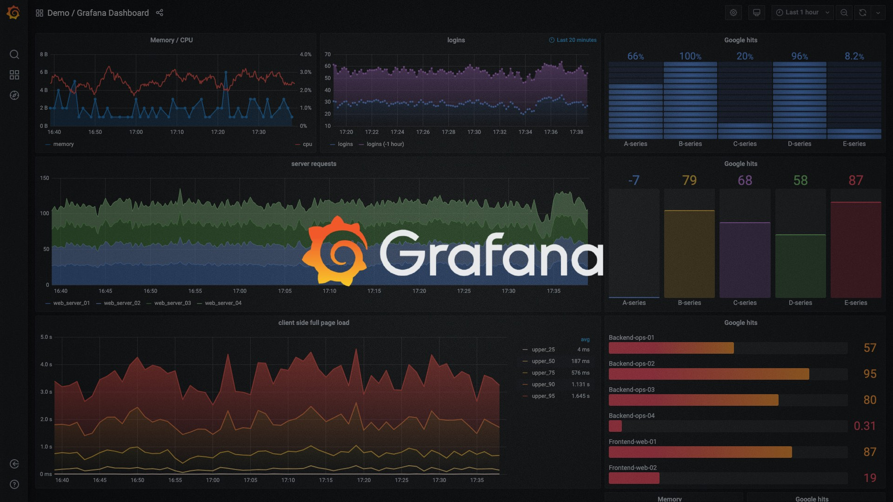

##1.3 Node Exporter

_What is Node Exporter ?_

- Node exporter is one of the Prometheus exporters which is used to expose servers or system OS metrics.

- With the help of Node exporter we can expose various resources of the system like RAM, CPU utilization, Memory Utilization, disk space.

- Node exporter runs as a system service which gathers the metrics of your system and that gathered metrics is displayed with the help of Grafana visualization tool.

##4. Alertmanager

- The Alertmanager handles alerts sent by client applications such as the Prometheus server. It takes care of deduplicating, grouping, and routing them to the correct receiver integration such as email, PagerDuty, or OpsGenie. It also takes care of silencing and inhibition of alerts.

- Alerting with Prometheus is separated into two parts. Alerting rules in Prometheus servers send alerts to an Alertmanager. The Alertmanager then manages those alerts, including silencing, inhibition, aggregation and sending out notifications via methods such as email, on-call notification systems, and chat platforms.

#**II/ Assignment**

##2.1 Deploy monitoring stack

**Requirements:**

Deploy monitoring stack (Prometheus + Grafana + Exporter + AlertManager)

**Prerequisites:**

- Ubuntu with 20.04 Version

- Root user account with sudo  privilege.

- Ports Required- 9090 (Prometheus), 3000 (Grafana), 9100 (Node Exporter)

- Docker

- Docker compose

**Monitoring stack:**

- Prometheus

- Grafana

- AlertManager

- Node Exporter

**Target:**

- Node exporter (To monitor underlining Linux OS)

- Prometheus metric (To monitor Prometheus tool)

- Docker metrics (To monitor containers)

- Alertmanager (To config alert rules and send alert to email)

### 2.1.1 Prerequisites

In this project, Im gonna use the virtual machine created on Azure Platform with following configurations:

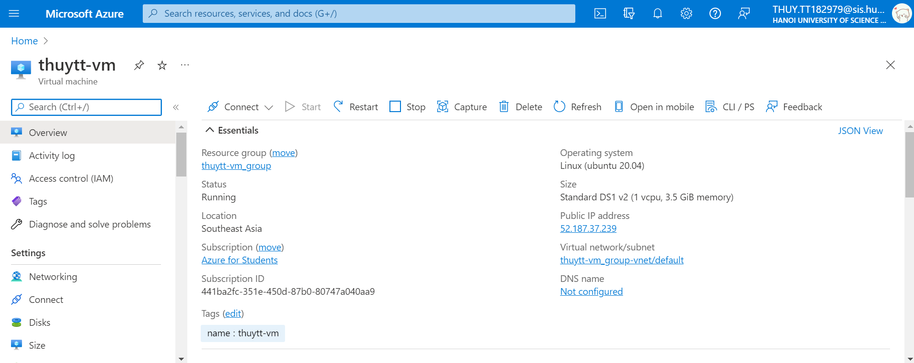

The VM running on OS Ubuntu 20.04 with the public IP adress 52.187.37.239.

Next, we need config the network rules to open port 9090 (Prometheus), 3000 (Grafana), 9100 (Node Exporter)

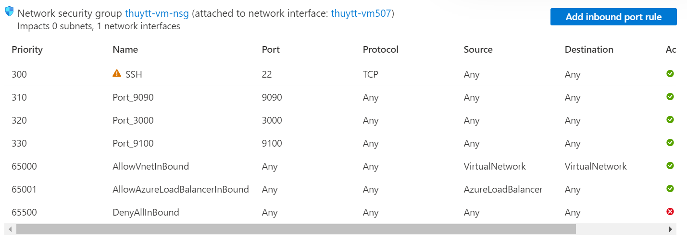

After the VM was created, we need to download the 'key.pem' file for permission to connect to that VM from our local host.

### 2.1.2 File dockercompose.yml

Create a dockercompose.yml file as below:

    version: '2'
    services:
     prometheus:
     image: prom/prometheus
     ports:
          - '9090:9090'
        container_name: prometheus
        restart: always
        network_mode: host
        volumes:
        - '$HOME/prometheus/prometheus.yml:/etc/prometheus/prometheus.yml'
    grafana:
     image: grafana/grafana
     ports:
          - '3000:3000'
        container_name: grafana
        restart: always
        network_mode: host
        depends_on:
          - prometheus
     volumes:
          - '$HOME/grafana/config/grafana.ini:/etc/grafana/grafana.ini'
          
     alertmanager:
     image: prom/alertmanager:v0.20.0
     ports:
          - '9093:9093'
        container_name: alertmanager
        restart: always
        network_mode: host
        depends_on:
          - prometheus
     volumes:
          - '$HOME/alertmanager/config.yml:/etc/alertmanager/config.yml'
 
     nodeexporter:
     image: image: prom/node-exporter:v0.18.1
     ports:
          - '9100:9100'
        container_name: nodeexportert
        restart: always
        network_mode: host
        depends_on:
          - prometheus
     volumes:
          - '$HOME/grafana/config/grafana.ini:/etc/grafana/grafana.ini'
          
- We have two services named Prometheus and  Grafana. They are both have certain images that we gonna pull from docker hub.

- The default port for Prometheus is 9090 and port 3000 is default for Grafana.

- "restart: always" is to make sure that both services are running (If the status is stop, it will be started automatically).

- The volume show the path to configuration file of each service, which needs to be copied into a docker container 

 ###2.1.3. File prometheus.yml
    
   This is the configuration file of prometheus
    
    global:
    scrape_interval: 15s 
    evaluation_interval: 15s 
 
    # Alertmanager configuration
     alerting:
       alertmanagers:
        - static_configs:
            - targets:
                - localhost:9093

     rule_files:
    - 'alert.rules.yml'

    scrape_configs: 
    - job_name: 'prometheus'
        scrape_interval: 5s
        static_configs:
         - targets: ['localhost:9090']

    - job_name: 'node_exporter'
        scrape_interval: 15s
        static_configs:
          - targets: ['localhost:9100']
    

**Global block** is the configuration control block of Prometheus server

- 'scrape_interval' is the time cycle of fetching metric from target hosts and 

- 'evaluation_interval' is the cycle for evaluation which define in rules. (

- The data may go up or under a threshole, it will send notification

**Alertmanger configuration**

- I have set up on port 9093, my allied is running on this port.

**Scape_config block** is the same configuration as I mentioned in targets

- We have job name

In other config file of service, I keep it in defaults. You might want to check it on the attached files commited with this one.

So we gonna  check the prometheus status and version

Go to 52.187.37.239:9090 to check dashboard

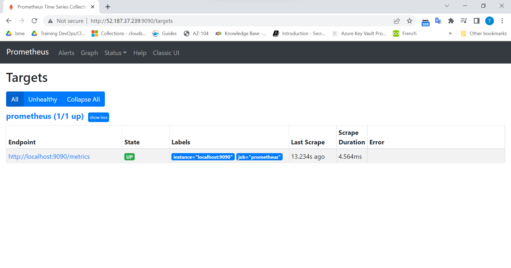

You can choose different types of metric

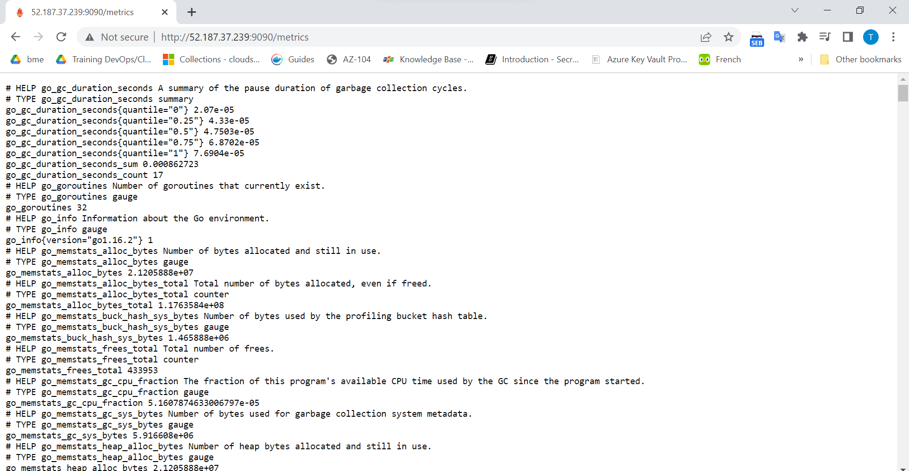

Or take a glance at the graph

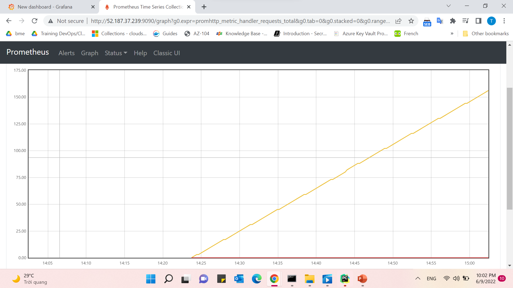

##2.2 Define alert rules 

So in the previous section with promethemus.yml, we already have

    rule_files:
        - 'alert.rules.yml'

which means prometheus will load this file, evaluate rules in this file every 'evaluation_interval' seconds

Next, we will create file alert.rules.yml with following content. 
This file should reside within the Prometheus configurations directory /etc/prometheus

    groups:
    - name: alert.rules
    rules:
    - alert: InstanceDown
        expr: up == 0
        for: 1m
        labels:
          severity: "critical"
        annotations:
          summary: "Endpoint {{ $labels.instance }} down"
          description: "{{ $labels.instance }} of job {{ $labels.job }} has been down for more than 1 minutes."
  
    - alert: HostOutOfMemory
        expr: node_memory_MemAvailable / node_memory_MemTotal * 100 < 25
        for: 5m
        labels:
          severity: warning
        annotations:
          summary: "Host out of memory (instance {{ $labels.instance }})"
          description: "Node memory is filling up (< 25% left)\n  VALUE = {{ $value }}\n  LABELS: {{ $labels }}"

    - alert: HostOutOfDiskSpace
        expr: (node_filesystem_avail{mountpoint="/"}  * 100) / node_filesystem_size{mountpoint="/"} < 50
        for: 1s
        labels:
          severity: warning
        annotations:
          summary: "Host out of disk space (instance {{ $labels.instance }})"
          description: "Disk is almost full (< 50% left)\n  VALUE = {{ $value }}\n  LABELS: {{ $labels }}"

    - alert: HostHighCpuLoad
        expr: (sum by (instance) (irate(node_cpu{job="node_exporter_metrics",mode="idle"}[5m]))) > 80
        for: 5m
        labels:
          severity: warning
        annotations:
          summary: "Host high CPU load (instance {{ $labels.instance }})"
          description: "CPU load is > 80%\n  VALUE = {{ $value }}\n  LABELS: {{ $labels }}"

We have 4 rules group in this file, starting with 'name: <rule-groups-name>'

- 'expr' is the condition required for the alert to trigger.

- 'for' is the minimum duration for an alert’s expression to be true (active) before updating to a firing status

- 'labels' can be anything, any labels that attached to the alert

- 'annotations' is a way to communicate actionable or contextual information such as a description or runbook link

##2.3 Configure alertmanager to push alert to mail

Config file alertmanager.yml with command

    $ vim /etc/alertmanager/alertmanager.yml

In this setup, I will be sending the alerts via Email and I will use Gmail in that case.

    global:
    resolve_timeout: 1m

    route:
    group_by: ['alertname']
    group_wait: 10s
    group_interval: 10s
    repeat_intervel: 1h
    receiver: 'email-notifications'

    receivers:
    - name: 'email-notifications'
    email_configs:
    - to: <yourmail>@gmail.com
        from: <yourmail>@gmail.com
        smarthost: smtp.gmail.com:587
        auth_username: <yourmail>@gmail.com
        auth_identity: <yourmail>@gmail.com
        auth_password: password
        send_resolved: true
    
  Save and exit the configuration file. Be sure to set the email settings appropriately.

  You can run Alertmanager in standalone mode by executing the command below:
  
      $alertmanager --config.file /etc/alertmanager/alertmanager.yml
  
  So in this file, we have 3 main components:
  
- global: contain global variables use to send alert message 

- route: define groups và group user to receive notifications, time to

- receivers: define the group user, list email adress, information like username, password, sending mail host,... (here the sending mail host of gmail is smtp.gmail.com:587)

So for the password, you should not using your 'real' password for email. Go to "Mange your Google account". 
Choose 'security' is where you create your app password so you can create an app password.
 
 
 
 Ok! So for the case that one instance was down.
 
  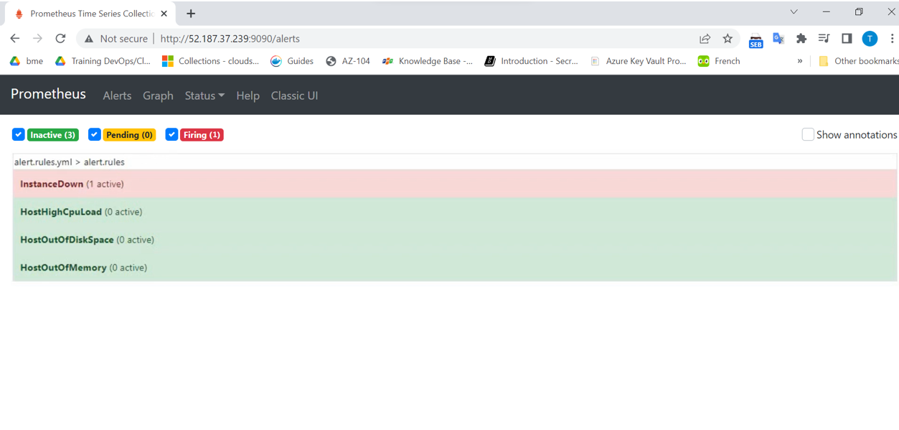
 
 The alert push to email.
 
   
  
   
   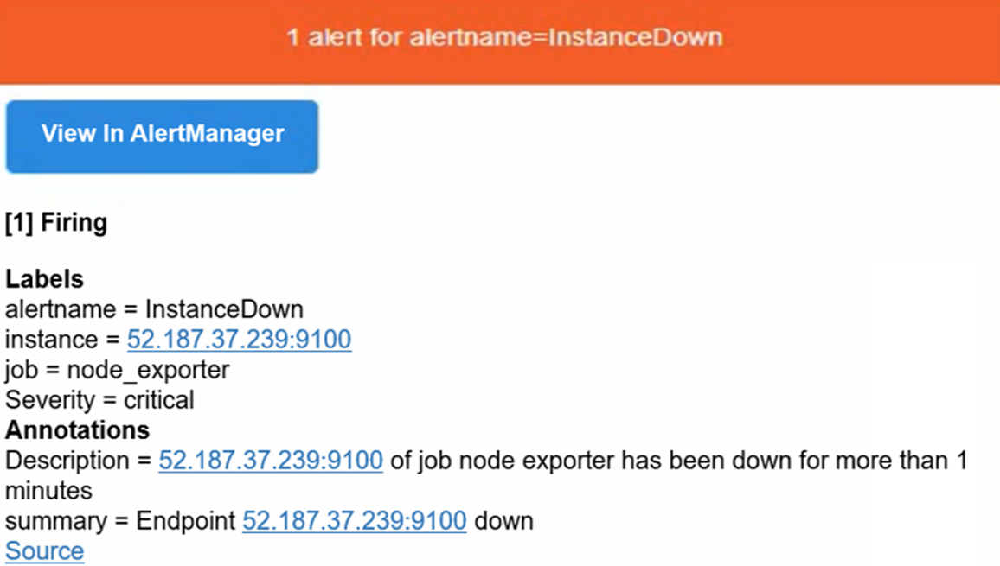
   
   
##2.4 Create Grafana dashboard

Log into Grafana by port 3000, enter password and username both is 'admin' 

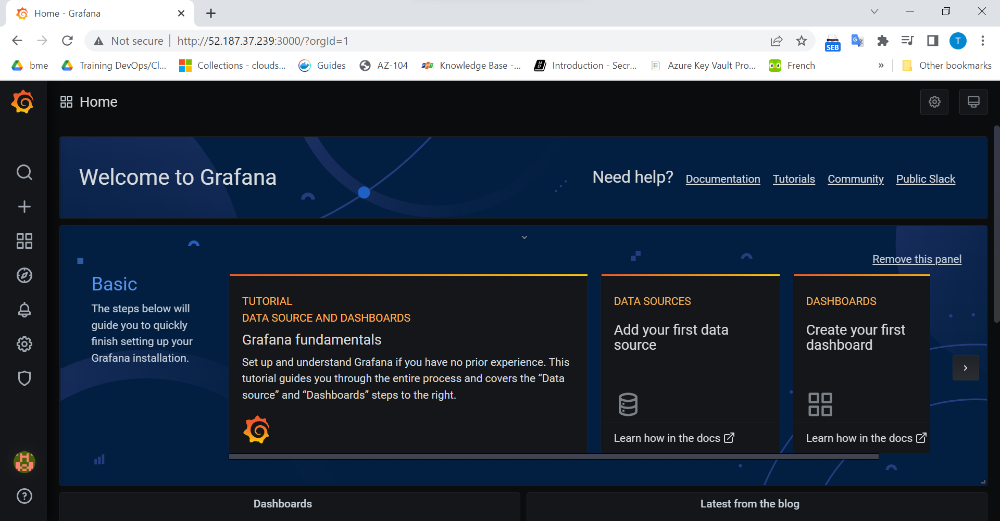

From the main page we gonna add the datasource, please choose prometheus 

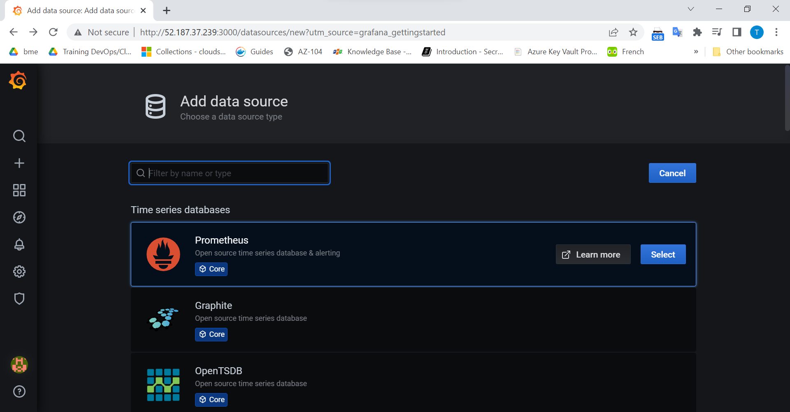

Then, enter the IP adress to the Prometheus interface. Click 'Save and Test' 

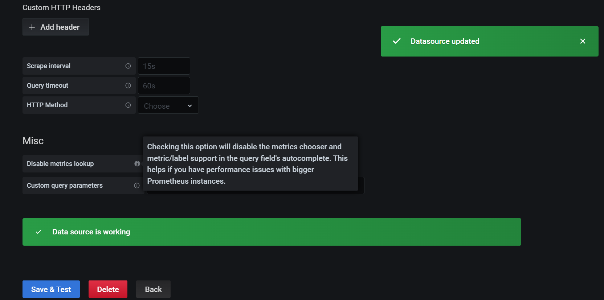

and again from the main page, click + Create + Dashboard.

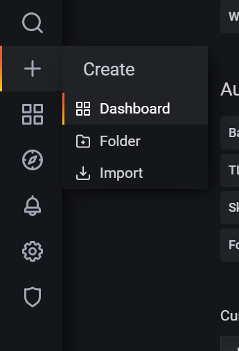

Next, choose Prometheus datasource which have been created in previous step and choose metric algorithms

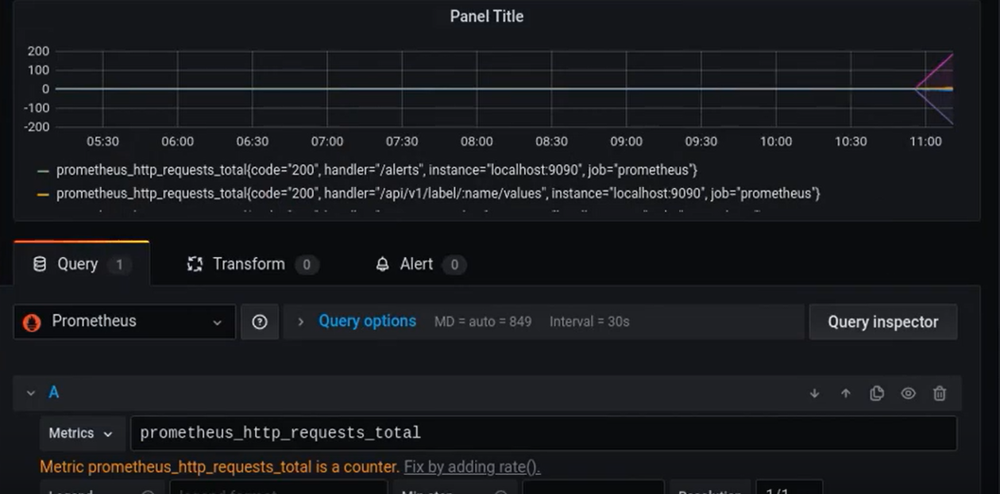 
 

 ## V. References
 - [Rules](https://prometheus.io/docs/prometheus/latest/configuration/recording_rules/)
 - [EmailALert](https://hocchudong.com/prometheus-tich-hop-canh-bao-qua-email-phan-4/)
 - [Monitoring Stack](https://docs.openshift.com/dedicated/osd_cluster_admin/osd_monitoring/osd-understanding-the-monitoring-stack.html)
 